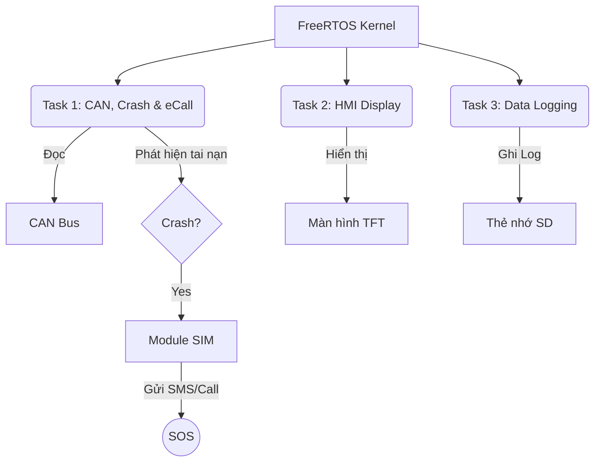

# 🚗 Automotive Black Box (STM32)

> **Hệ thống Hộp đen và Cảnh báo khẩn cấp cho ô tô dựa trên STM32 & FreeRTOS**

   

---
## 📖 Giới thiệu (Overview)

Dự án này là một hệ thống nhúng thời gian thực mô phỏng chức năng của **"Hộp đen"** trên ô tô. Hệ thống giám sát các thông số vận hành quan trọng, tự động phát hiện va chạm và thực hiện quy trình cứu hộ khẩn cấp (eCall).

> ⚠️ **Lưu ý quan trọng (Disclaimer):**
> Dự án này được phát triển **thuần túy cho mục đích nghiên cứu và học tập**.
> Các tín hiệu vận hành (Tốc độ, RPM, Nhiệt độ) **không được lấy từ xe thực tế** mà được **mô phỏng giả lập** bởi một vi điều khiển phụ (MCU) khác gửi qua giao thức CAN Bus để kiểm chứng thuật toán.

### 🎯 Tính năng nổi bật
* **📡 Giám sát thời gian thực:** Thu thập Tốc độ (Speed), Vòng tua (RPM), Nhiệt độ qua **CAN Bus** (mô phỏng OBD-II).
* **💾 Hộp đen (Black Box):** Ghi log hành trình vào **thẻ nhớ SD** với thời gian thực (RTC DS3231) để phục vụ kiểm tra log của động cơ hoặc điều tra sau tai nạn.
* **💥 Phát hiện tai nạn:** Thuật toán dựa trên gia tốc (ví dụ: giảm từ 100km/h về 0km/h trong <1s).
* **🆘 Cảnh báo khẩn cấp (eCall):** Tự động gửi SMS tọa độ GPS và gọi điện cho số cứu hộ qua module **SIM và GPS**.
* **🖥️ Giao diện HMI:** Hiển thị trực quan trên màn hình **TFT ST7735**.

---

## 🛠️ Phần cứng sử dụng (Hardware)

| Linh kiện | Chức năng | Giao tiếp (STM32 Pin) |
| :--- | :--- | :--- |
| **STM32F103C8T6** | Vi điều khiển trung tâm (MCU) | - |
| **TJA1050 / MCP2551** | Module thu phát CAN Bus | `PA11`, `PA12` |
| **DS3231** | Đồng hồ thời gian thực (RTC) | I2C1 (`PB6`, `PB7`) |
| **MicroSD Card Module** | Lưu trữ dữ liệu Log | SPI2 (`PB13`, `PB14`, `PB15`, `PB9`) |
| **ST7735 (1.8" TFT)** | Màn hình hiển thị | SPI1 (`PA5`, `PA7`, `PA4`, `PA3`, `PA2`) |
| **A7680C** | Gửi SMS & Gọi điện | UART2 (`PA2`, `PA3`) |
| **CH340** | Ghi log | UART1 (`PA9`, `PA10`) |

---

## 🧠 Kiến trúc hệ thống (System Architecture)

Hệ thống chạy trên nền tảng **FreeRTOS** với các tác vụ (Tasks) song song:

## 🚀 Hướng dẫn cài đặt & Chạy thử (Installation & Testing)

Để chạy được toàn bộ hệ thống mô phỏng (gồm 1 mạch Gửi tín hiệu và 1 mạch Nhận xử lý), bạn cần thực hiện theo các bước sau:

### Bước 1: Chuẩn bị phần cứng & Phần mềm
1.  **Phần mềm:** Cài đặt hoặc KeilC + STM32CubeMX.
2.  **Phần cứng:**
    * Kết nối các module với STM32 theo sơ đồ chân (Pinout) đã cung cấp ở trên.
    * **Thẻ nhớ SD:** Phải được Format sang định dạng **FAT32** (Lưu ý thẻ phải <32GB).

### Bước 2: Nạp Code (Flashing)
1.  **Clone repository** này về máy tính.
2.  Trong thư mục project có 2 phần code riêng biệt cho 2 vi điều khiển:
    * 📂 **Folder `final`**: Code cho **Mạch NHẬN** (Mạch chính: Xử lý tai nạn, màn hình, SIM, thẻ nhớ).
    * 📂 **Folder `Can_Trans`**: Code cho **Mạch GỬI** (Mạch phụ: Giả lập tín hiệu động cơ/cảm biến gửi đi).
3.  Mở lần lượt từng project bằng **STM32CubeIDE**.
4.  Tiến hành **Build** và **Nạp (Flash)** code tương ứng vào 2 bo mạch STM32.

### Bước 3: Kiểm thử (Simulation Mode)

#### 1. Kết nối vật lý
* Kết nối 2 dây bus: **CAN H** nối với **CAN H**, **CAN L** nối với **CAN L** giữa 2 module CAN (TJA1050 hoặc MCP2551).
* Đảm bảo chung GND nếu dùng nguồn riêng lẻ.

#### 2. Kịch bản chạy thử
Khi cấp nguồn, quy trình mô phỏng sẽ diễn ra như sau:

* **Khởi động:** Màn hình TFT sáng và bắt đầu hiển thị các thông số (Speed, RPM, Temp).
* **Tăng tốc:** Vi điều khiển Gửi sẽ giả lập xe tăng tốc từ **0 km/h lên 100 km/h**.
* **Va chạm (Crash):** Ngay khi đạt 100 km/h, hệ thống tự động giảm tốc độ đột ngột về **0 km/h** (Mô phỏng tình huống đâm xe vào vật cản).
* **Xử lý tai nạn:**
    * Sau **3 giây** phát hiện va chạm, hệ thống xác nhận tai nạn.
    * Module SIM thực hiện: **Gửi SMS cảnh báo** -> **Gọi điện khẩn cấp**.
* **Trạng thái hoạt động:** Đèn LED **PC13** trên mạch chính sẽ nhấp nháy liên tục, báo hiệu dữ liệu(đọc từ Can bus) đang được ghi vào thẻ nhớ SD.
